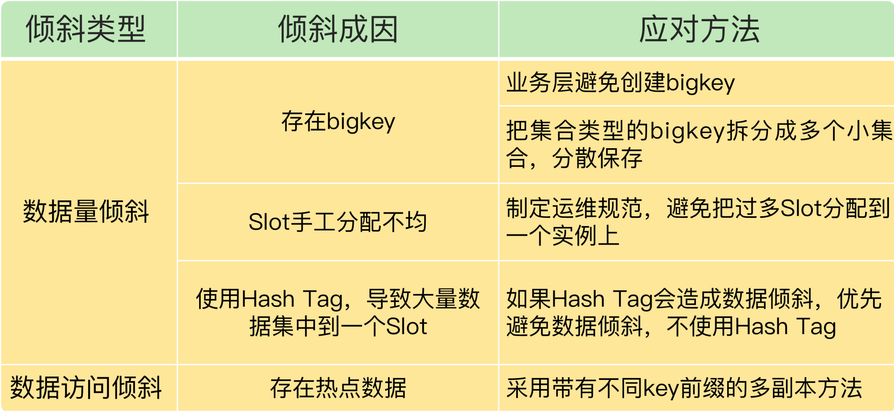

# Redis核心技术与实战

## 1. 基本架构：一个键值数据库包含什么？

**可以存哪些数据？**

对于键值数据库而言，基本的数据模型是 key-value 模型。 Redis 支持的 value 类型包括了 String、哈希表、列表、集合等。

**可以对数据做什么操作？**

PUT/GET/DELETE/SCAN是一个键值数据库的基本操作集合。scan操作，根据一段key的范围返回响应的value值。

**采用什么访问模式？**

一种是通过函数库调用的方式供外部应用使用，另一种是通过网络框架以 Socket 通信的形式对外提供键值对操作。例如，RocksDB 以动态链接库的形式使用，而 Memcached 和 Redis 则是通过网络框架访问。

**如何确定键值对的位置？**

索引的作用是让键值数据库根据 key 找到相应 value 的存储位置，进而执行操作。，例如，Memcached 和 Redis 采用哈希表作为 key-value 索引，而 RocksDB 则采用跳表作为内存中 key-value 的索引。内存键值数据库（例如 Redis）采用哈希表作为索引，很大一部分原因在于，其键值数据基本都是保存在内存中的，而内存的高性能随机访问特性可以很好地与哈希表O(1) 的操作复杂度相匹配。

## 2. 数据结构：快速的Redis有哪些慢操作？

为什么 Redis速度快？一方面，这是因为它是内存数据库，所有操作都在内存上完成，内存的访问速度本身就很快。另一方面，这要归功于它的数据结构。

**键和值用什么结构组织？**

Redis使用了一个哈希表来保存所有键值对。哈希桶中的entry元素中保存了*key和*value指针，分别指向了时机的键和值。

Redis 解决哈希冲突的方式，就是链式哈希。Redis会对哈希表做rehash操作。增加现有哈希桶数量，让增多的entry元素能在更多的桶之间分散保存。Redis 默认使用了两个全局哈希表：哈希表 1 和哈希表 2。一开始，当你刚插入数据时，默认使用哈希表 1，此时的哈希表 2 并没有被分配空间。随着数据逐步增多，Redis 开始执行 rehash，这个过程分为三步：

1. 给哈希表 2 分配更大的空间，例如是当前哈希表 1 大小的两倍；
2. 把哈希表 1 中的数据重新映射并拷贝到哈希表 2 中；
3. 释放哈希表 1 的空间。

如果一次性把哈希表 1 中的数据都迁移完，会造成 Redis 线程阻塞，无法服务其他请求。Redis 采用了**渐进式 rehash**。每处理一个请求

时，从哈希表 1 中的第一个索引位置开始，顺带着将这个索引位置上的所有 entries 拷贝到哈希表 2 中；等处理下一个请求时，再顺带拷贝哈希表 1 中的下一个索引位置的entries。

对于范围操作，是指集合中的遍历操作，可以返回集合中的所有数据。复杂度一般是O（N），比较耗时，尽量避免。Redis从2.8版本开始提供了SCAN系列操作，(HSCAN,SSCAN,ZSCAN)，这类操作实现了渐进式遍历，每次只返回有限数量的数据。相比于HGETALL、SMEMBERS 这类操作来说，就避免了一次性返回所有元素而导致的 Redis 阻塞。

## 36. Redis支撑秒杀场景的关键技术和实践都有哪些？

**秒杀场景的负载特征对支撑系统的要求：**

- **瞬时并发访问量非常高**
- **读多写少，而且读操作是简单的查询操作：**用户需要先查验商品是否还有库存，只有库存有余量时，秒杀系统才能进行库存扣减和下单操作。只有少部分用户能成功下单，所以，商品库存查询操作（读操作）要远多于库存扣减和下单操作（写操作）。

**秒杀分为三个阶段：**

- **秒杀前：**用户会刷新页面，请求剧增。解决方案把商品页面元素静态化，然后使用CDN或者浏览器进行缓存。
- **秒杀开始：**这个阶段有三个操作：库存查验、库存扣减和订单处理。前两个操作用redis，订单处理用数据库。订单处理时只有少数人，请求压力不大而且设计多张表需要事务，所以在数据库完成。如果把库存扣减放到数据库执行有两个问题：1. **额外的开销**，数据库和redis需要对库存量进行同步。2. **下单量超过实际库存量，出现超售**，数据库处理慢，redis更新不及时。
- **秒杀后：**请求已经下降，不讨论。

**秒杀场景对 Redis 操作的根本要求有两个：**

- **支持高并发：**redis天然支持，可以用切片集群，将不同商品的库存保存到不同的实例。注意一致性hash。
- **保证库存查验和库存扣减原子执行：**使用redis原子操作或者分布式锁实现。

**保证库存查验和库存扣减原子执行：**

因为库存查验和库存扣减这两个操作要保证一起执行，**一个直接的方法就是使用 Redis 的原子操作**。

- **基于原子操作支撑秒杀场景：**原子操作可以是自身提供的原子命令，或者是Lua脚本。
- **基于分布式锁来支撑秒杀场景：**使用分布式锁来支撑秒杀场景的具体做法是，先让客户端向 Redis 申请分布式锁，只有拿到锁的客户端才能执行库存查验和库存扣减。可以使用切片集群中的不同实例来分别保存分布式锁和商品库存信息，可以减轻库存实例的压力。

## 37. 数据分布优化，如果应对数据倾斜？

**在切片集群中，数据会按照一定的分布规则分散到不同的实例上保存。会导致数据倾斜问题，有两种情况：**

- **数据量倾斜**：在某些情况下，实例上的数据分布不均衡，某个实例上的数据特别多。
- **数据访问倾斜**：虽然每个集群实例上的数据量相差不大，但是某个实例上的数据是热点数据，被访问得非常频繁。

**数据量倾斜：**

- **bigkey导致倾斜：**bigkey的value值会很大或保存大量的集合元素，会导致该实例数据量增加，内存消耗增加。而且bigkey的操作会造成实例阻塞。**要尽量避免把过多的数据保存在同一个键值对中，例如是集合类型，拆分成多个小集合保存在不同实例。**

- **Slot分配不均衡导致倾斜：**如果有大量的数据被分配到同一个 Slot 中，一个 Slot 只会在一个实例上分布，会大量数据被集中到一个实例上。

- **Hash Tag导致倾斜：**Hash Tag 是指加在键值对 key 中的一对花括号{}。这对括号会把 key 的一部分括起来，客户端在计算 key 的 CRC16 值时，只对 Hash Tag 花括号中的 key 内容进行计算。如果没用 Hash Tag 的话，客户端计算整个 key 的 CRC16 的值。Hash Tag 的好处是，如果不同 key 的 Hash Tag是一样的，那么，这些 key对应的数据会被映射到同一个 Slot 中，同时会被分配到同一个实例上。Hash Tag应用的场景是 把要执行事务操作或是范围查询

  的数据映射到同一个实例上，这样就能很轻松地实现事务或范围查询了。**使用 Hash Tag 的潜在问题，就是大量的数据可能被集中到一个实例上，导致数据倾斜，集群中的负载不均衡。**解决方法是进行取舍，如果出现数据倾斜造成较大的访问压力，优先考虑避免数据倾斜，最好不要使用 Hash Tag 进行数据切片。因为事务和范围查询都还可以放在客户端来执行。

**数据访问倾斜：**

发生数据访问倾斜的根本原因，就是实例上存在热点数据。**对于只读的热点数据**，采用**热点数据多副本**的方法来应对。把热点数据复制多份，在每一个数据副本的 key 中增加一个随机前缀，让它和其它副本数据不会被映射到同一个 Slot 中。这样，热点数据既有多个副本可以同时服务请求，同时，这些副本数据的 key 又不一样，会被映射到不同的 Slot中。在给这Slot 分配实例时，我们也要注意把它们分配到不同的实例上，那么，热点数据的访问压力就被分散到不同的实例上了。对于有读有写的热点数据不适合多副本方法，需要保证多副本数据的一致性，有开销，直接升级硬件。

总结：

## 38. 通信开销：限制Redis Cluster规模的关键因素

​	Redis 官方给出了 Redis Cluster 的规模上限，就是一个集群运行 1000 个实例。关键因素：**实例间的通信开销会随着实例规模增加而增大**，规模过大，集群吞吐量会下降。

**实例通信方法和对集群规模的影响：**

​	Redis Cluster的每个实例上都会保存 Slot 和实例的对应关系。实例之间的通信协议为Gossip协议。Gossip 协议可以保证在一段时间后，集群中的每一个实例都能获得其它所有实例的状态信息。有新节点加入、节点故障、Slot 变更等事件发生，实例间也可以通过PING、PONG 消息的传递，完成集群状态在每个实例上的同步。

**Gossip协议工作原理：**

1. **PING消息：** 每个实例之间会按照一定的频率，从集群中随机挑选一些实例，发送PING 消息，检测这些实例是否在线，并交换彼此的状态信息。PING 消息中封装了发送消息的实例自身的状态信息、部分其它实例(集群中1/10的实例)的状态信息，以及 Slot 映射表，如果是1000个实例，PING消息大概12KB。
2. **PONG消息：** 实例在接收到 PING 消息后，会返回一个 PONG 消息。PONG 内容和 PING 消息一样。

**Gossip通信开销受到通信消息大小和通信频率影响。**

​	Redis Cluster 的实例启动后，默认会每1秒从本地的实例列表中随机选出 5 个实例，再从这5个实例中找出一个最久没有通信的实例，发送PING。防止有实例一直不被选中，每100ms扫描所有实例，发现最近一次接收PONG消息的时间，超过配置项 cluster-node-timeout(定义了集群实例被判断为故障的心跳超时时间,默认15s)的一半，立刻发送PING。

**如果降低实例间的通信开销：**

每 1 秒发送一条 PING 消息，频率不高，不能改。100ms也不用改。就增大配置项 cluster-node-timeou就可以了，增加到25s或者20s。

## 39. Redis6.0新特性：多线程、客户端缓存与安全

**从单线程处理网络请求到多线程处理**

原来redis是单线程架构，但是数据删除、快照生成、AOF重写是子进程或子线程。网络IO村里到实际的读写命令处理是单线程。但是**单个主线程处理网络请求的速度跟不上底层网络硬件的速度**。有两种解决方法，1.用用户态网络协议栈（例如 DPDK）取代内核网络协议栈，让网络请求的处理不用在内核里执行，直接在用户态完成处理就行。2. 采用多个IO线程来处理网络请求(让多个io线程负责socket的读写，而接收新连接和命令的执行还是在主线程)，提高网络请求处理的并行度。

**Redis6.0主线程和IO线程具体协作流程：**

- **阶段一：服务端和客户端建立Socket连接，并分配处理线程**

首先，主线程负责接收建立连接请求。当有客户端请求和实例建立 Socket 连接时，主线程会创建和客户端的连接，并把 Socket 放入全局等待队列中。紧接着，主线程通过轮询方法把 Socket 连接分配给 IO 线程。

- **阶段二：IO 线程读取并解析请求**

主线程一旦把 Socket 分配给 IO 线程，就会进入阻塞状态，等待 IO 线程完成客户端请求读取和解析。因为有多个 IO 线程在并行处理，所以，这个过程很快就可以完成。

- **阶段三：主线程执行请求操作**

等到 IO 线程解析完请求，主线程还是会以单线程的方式执行这些命令操作。下面这张图显示了刚才介绍的这三个阶段，你可以看下，加深理解。

- **阶段四：IO 线程回写 Socket 和主线程清空全局队列**

当主线程执行完请求操作后，会把需要返回的结果写入缓冲区，然后，主线程会阻塞等待IO 线程把这些结果回写到 Socket 中，并返回给客户端。和 IO 线程读取和解析请求一样，IO 线程回写 Socket 时，也是有多个线程在并发执行，所以回写 Socket 的速度也很快。等到 IO 线程回写 Socket 完毕，主线程会清空全局队列，等待客户端的后续请求。如下图所示。

**在Redis6.0中默认是关闭多线程的：** 设置`io-thread-do-reads`配置项为yes，表示启用多线程。线程个数要小于cpu核个数。

**实现服务端协助的客户端缓存**

此为Redis6.0新功能，也称为跟踪(Tracking)功能。此功能，Redis客户端可以把读取的数据缓存在业务应用本地。发呢为两种模式。

**第一种模式是普通模式**

​	此模式，实例会在服务端记录客户端读取过的 key，并监测 key 是否有修改。一旦 key 的值发生变化，服务端会给客户端发送 invalidate 消息，通知客户端缓存失效。只能报告一个invalidate消息，客户端再次读才能再次检测。

**第二种模式是广播模式**

​	服务端会给客户端广播所有 key 的失效情况，但是 key 被频繁修改，服务端会发送大量的失效广播消息，消耗网络带宽。所以，在实际应用时，让客户端注册希望跟踪的 key 的前缀，当带有注册前缀的key 被修改时，服务端会把失效消息广播给所有注册的客户端。和普通模式不同，在广播模式下，即使客户端还没有读取过 key，但只要它注册了要跟踪的 key，服务端都会把key 失效消息通知给这个客户端。

**从简单的基于密码访问到细粒度的权限控制**

6.0 版本支持创建不同用户来使用 Redis。6.0 版本还支持以用户为粒度设置命令操作的访问权限。也支持key的粒度。

**启用 RESP 3 协议**

在 RESP 2 中，客户端和服务器端的通信内容都是以字节数组形式进行编码的，客户端需要根据操作的命令或是数据类型自行对传输的数据进行解码，增加了客户端开发复杂度。RESP 3 直接支持多种数据类型的区分编码，包括空值、浮点数、布尔值、有序的字典集合、无序的集合等。RESP 3 协议还可以支持客户端以普通模式和广播模式实现客户端缓存。

## 40. Redis的下一步：基于NVM内存的实践   (不用看)
