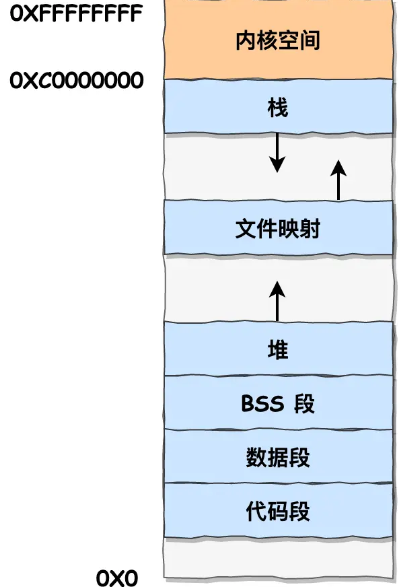
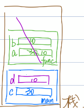

## C++指针与内存管理

### 进程结构



在 Linux 操作系统中，虚拟地址空间的内部又被分为**内核空间和用户空间**两部分，虽然每个进程都各自有独立的虚拟内存，但是**每个虚拟内存中的内核地址，其实关联的都是相同的物理内存**。这样，进程切换到内核态后，就可以很方便地访问内核空间内存。

- 代码段，包括二进制可执行代码；
- 数据段，包括已初始化的静态常量和全局变量；
- BSS 段，包括未初始化的静态变量和全局变量；
- 堆段，包括动态分配的内存，从低地址开始向上增长；
- 文件映射段，包括动态库、共享内存等，从低地址开始向上增长（[跟硬件和内核版本有关 (opens new window)](http://lishiwen4.github.io/linux/linux-process-memory-location)）；
- 栈段，包括局部变量和函数调用的上下文等。栈的大小是固定的，一般是 `8 MB`。当然系统也提供了参数，以便我们自定义大小；

### malloc()

在这 6 个内存段中，堆和文件映射段的内存是动态分配的。比如说，使用 C 标准库的 `malloc()` 或者 `mmap()` ，就可以分别在堆和文件映射段动态分配内存。

malloc 申请内存的时候，会有两种方式向操作系统申请堆内存。

malloc() 源码里默认定义了一个阈值：

- 如果用户分配的内存小于 128 KB，则通过 brk() 申请内存；malloc() 在分配内存的时候，会预分配更大的空间作为内存池。
- 如果用户分配的内存大于 128 KB，则通过 mmap() 申请内存；

- malloc 通过 **brk()** 方式申请的内存，free 释放内存的时候，**并不会把内存归还给操作系统，而是缓存在 malloc 的内存池中，待下次使用**；
- malloc 通过 **mmap()** 方式申请的内存，free 释放内存的时候，**会把内存归还给操作系统，内存得到真正的释放**。

**malloc并不是系统调用，brk和mmap是系统调用。**

### free() 函数只传入一个内存地址，为什么能知道要释放多大的内存？

malloc会多申请16字节，多出来的 16 字节就是保存了该内存块的描述信息，比如有该内存块的大小。当执行 free() 函数时，free 会对传入进来的内存地址向左偏移 16 字节，然后从这个 16 字节的分析出当前的内存块的大小，自然就知道要释放多大的内存了。


### 栈空间分配



调用函数会在栈空间给函数分配一段空间，然后其中的局部变量也都在函数的占空间内，当函数调用完毕后，函数的占空间会被释放，其中的局部变量也会被释放，上图显示了在main函数中调用函数func的例子。

### new/delete

执行`new`会有几步操作:

```cpp
Test *p2 = new Test();
//上述的new操作会等效下面的三步(伪代码)
void *mem = operator new();
Test *p2 = (Test*)mem;
p2-->Test::Test();
```

执行delete:

```cpp
delete p2;
p2-->~Test();
operator delete(p2);
```

`new`和`delete`是运算符，`operator new()`和`operator delete()` 是c++的函数，其内部会调用`malloc`和`free`，而且这两个函数可以重写。

### 智能指针unique_ptr和shared_ptr

#### unique_ptr

`std::unique_ptr` 提供对动态分配的单⼀对象所有权的独占管理。通过独占所有权，确保只有⼀个 `std::unique_ptr` 可以拥有指定的内存资源。移动语义和右值引⽤允许 `std::unique_ptr` 在所有权转移时⾼ 效地进⾏转移。

1. 默认情况下，`unique_ptr`大小等于原始指针的大小,一般为8字节。
2. `unique_str`不允许拷贝，只允许移动
3. 智能指针可以自定义删除器,但是这可能会产生大尺寸的`unique_ptr`对象

```cpp
void delInvmt2 (Investment *pInvestment)
{
	delete pInvestment;
}
std::unique_ptr<Investment, void(*)(Investment*)> uptr(nullptr, delInvmt2);
```

#### shared_ptr

`std::shared_ptr` 允许多个智能指针共享同⼀块内存资源。内部使⽤引⽤计数来跟踪对象被共享的次数，当计数 为零时，资源被释放。提供更灵活的内存共享，但可能存在循环引⽤的问题。

`shared_ptr`一般是16字节大小，比正常指针大一倍

`shared_ptr`结构:


其中包含一个原始指针和一个指向控制块的指针。控制块内包含引用计数，自定义删除器，所以`shared_ptr`自定义删除器是删除器是不会增加`shared_ptr`的大小的，这与`unique_ptr`不同。`shared_ptr`不支持数组。

`control block`的生成时机:

1. 使用`make_shared`
2. 通过`unique_ptr`构造`shared_ptr`
3. 向`shared_ptr`的构造函数中传入一个裸指针。

`share_ptr`的问题:

重复释放堆对象，从上面的图看，`T object` 和`Control Block`是关联到一起的，但是如果两个`Control Block`与同一个`T object`关联，大概率会多次释放。


```cpp
auto pt = new Test;
std::shared_ptr<Test> spt1(pt);
std::shared_ptr<Test> spt2(pt);
```

此时两个`Control Blcok`中的引用计数都为1，在`spt1`和`spt2`都会进行释放，会释放两次。所以对于同一个对象，不管有多少个`share_ptr`都应该对应同一个`Control Block`。**解决方法:**用`shared_ptr`构造`shared_ptr`这样会调用`shared_ptr`的拷贝构造，而且不会生成新的`Control Block`。然后最好不要用裸指针指向堆对象，将`new Test`的返回的地址(形成右值)放入`shared_ptr`的构造函数中。可以避免后续用裸指针构造`shared_ptr`的情况。

```cpp
//用`spt1`构造`spt2`  用`shared_ptr`构造`shared_ptr`
std::shared_ptr<Test> stp2(spt1);
//在构造shared_ptr时 直接用堆区返回的右值地址构造，避免后续用裸指针构造shared_ptr
std::shared_ptr<Test> spt1(new Test);
```

`share_ptr`循环引用问题:


对于图中的三个a,b,c指针释放后，c指向的对象会被正常释放，因为没有指针再指向c所指向的堆内存，但是a和b指向的堆内存并不会被释放，因为它们两个在堆内存中互相指向，导致引用计数不为0.将其中一个指针改成`weak_ptr`就可以了，因为不会影响堆内存释放。

#### **weak_ptr**

`weak_ptr`不能单独使用，通常从`shared_ptr`创建。对于共享内存，如果没有共享指针指向这片区域，就会被释放。但是对于`weak_ptr`来说，如果`weak_ptr`指向这片区域，仍然会被释放，`weak_ptr`的存在并不能延长堆内存的生命周期。本质上来说，`weak_ptr`没有堆内存空间的所有权，只有借用权。

```c++
auto spw = std::make_shared<Widget>();
std::weak_ptr<Widget> spw(spw);
spw = nullptr;
```

虽然`wak_ptr`不能掌握堆对象的生死，但是`weak_ptr`知道这个堆上的对象存不存在。

```c++
wpw.expired();//返回true表明资源已经释放 
//weak_ptr不可以直接使用，需要先转成shared_ptr
std::shared_ptr<Widget> spw1 = wpw.lock();//如果wpw堆内存被释放，spw1则为空
std::shared_ptr<Widget> spw2(wpw);//如果wpw堆内存被释放，构造方式会抛异常
```

#### 优先使用make_unique和make_shared

1. 好处可以减少代码重复(能稍微少写点，作用不大)

2. 更安全

```c++
//更安全举例
processWidget(std::shared_ptr<Widget>(new Widget), computepriority());
这里有三个动作，如果先执行new Widget，然后执行computeriority(),然后再把内存空间的指针赋值给shared_ptr。这时如果computeriority()函数出现异常，那么会打断shared+ptr的构建。
上面存在异常风险的本质是因为在new Widget和将指针赋值给shared_ptr这两个操作被打断，所以将他这两步合并即可，用make_shared<Widget>()
```

3. `std::make_shared`与`new`相比有效率上的提升


看上面这张图片，是`shared_ptr`，它在堆区上有两个对象一个是`T Object`和`Control Block`。所以如果先new一个对象会先申请对象的空间，然后交给`shared_ptr`管理的时候会再申请`Control Block`的堆空间，会申请两次增加开销。如果用`make_shared`会一次将空间都申请下来。但是对于`unique_ptr`，只有一根指针，用不用`make_unique`没有什么区别。

#### make_unique和make_shared的局限性

1. 使用自定义删除器只能用new
2. 不能通过{}初始化指向的对象 (因为{}不能完美转发)

```c++
auto spv1 = std::make_shared<std::vector<int>>(10, 20);//定义10个20的vector
auto spv2 = std::make_shared<std::vector<int>> ({10, 20});//错误 不能通过编译
```

3. 如果类中重载了`operator new/delete`，使用`make_shared`不会执行重载函数

### Pimpl惯用法，请在实现文件中定义特殊成员函数


对于图中上半部分是第一种写法，缺点:1.如果`Gadget`发生改动，那么`widget.cpp`和`main.cpp`因为包含了`Widget.h`，其中又包含了`Gadget.h`导致`widget.cpp`和`main.cpp`两个文件都会重新编译，而且在使用`Widget`头文件时，还需要给出`Gadget.h`，而且在看到`Widget.h`其中的声明后，暴露了太多实现的内容，想要隐藏`Gadget g1`，而且发生改动后只需要重新编译`Widget.cpp`即可。

先半部分是改动后。

## 内联函数报错：“函数未定义引用”

这个问题出现的原因是内联函数的特性。内联函数是在编译时展开的，直接把代码粘贴到函数调用处，而不是在运行时通过函数调用机制调用的。因此，编译器需要在编译时就能看到内联函数的定义，而不仅仅是声明。

如果你在头文件中声明了一个内联函数，但是在实现文件中提供了定义，那么在包含这个头文件的其他源文件中，编译器只能看到声明，看不到定义。这就会导致“内联函数未定义引用”的错误。

因此，对于内联函数，我们通常在头文件中同时提供声明和定义，以确保编译器在编译任何包含这个头文件的源文件时都能看到内联函数的定义 。

 
