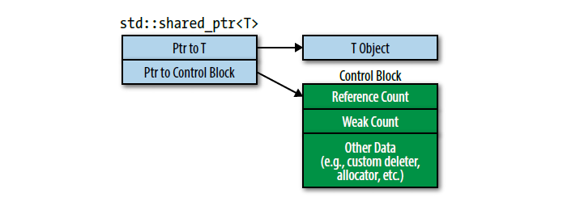
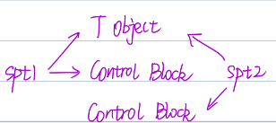
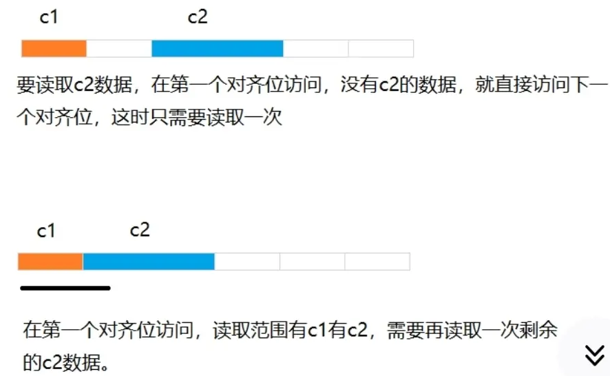
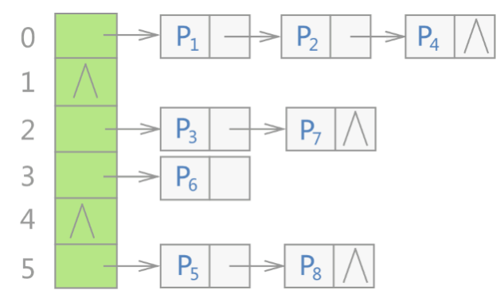

# 知识总结

## C++指针与内存管理

### 进程结构


在 Linux 操作系统中，虚拟地址空间的内部又被分为**内核空间和用户空间**两部分，虽然每个进程都各自有独立的虚拟内存，但是**每个虚拟内存中的内核地址，其实关联的都是相同的物理内存**。这样，进程切换到内核态后，就可以很方便地访问内核空间内存。

- 栈段，包括局部变量和函数调用的上下文等。栈的大小是固定的，一般是 `8 MB`。当然系统也提供了参数，以便我们自定义大小；
- 文件映射段，包括动态库、共享内存等，从低地址开始向上增长（[跟硬件和内核版本有关 (opens new window)](http://lishiwen4.github.io/linux/linux-process-memory-location)）；
- 堆段，包括动态分配的内存，从低地址开始向上增长；
- BSS 段，包括未初始化的静态变量和全局变量；
- 数据段，包括已初始化的静态常量和全局变量；
- 常量区：常量的存储位置，程序结束后由操作系统释放。
- 代码段，包括二进制可执行代码；

### malloc()

在这 6 个内存段中，堆和文件映射段的内存是动态分配的。比如说，使用 C 标准库的 `malloc()` 或者 `mmap()` ，就可以分别在堆和文件映射段动态分配内存。

malloc 申请内存的时候，会有两种方式向操作系统申请堆内存。

malloc() 源码里默认定义了一个阈值：

- 如果用户分配的内存小于 128 KB，则通过 brk() 申请内存；malloc() 在分配内存的时候，会预分配更大的空间作为内存池。
- 如果用户分配的内存大于 128 KB，则通过 mmap() 申请内存；

- malloc 通过 **brk()** 方式申请的内存，free 释放内存的时候，**并不会把内存归还给操作系统，而是缓存在 malloc 的内存池中，待下次使用**；
- malloc 通过 **mmap()** 方式申请的内存，free 释放内存的时候，**会把内存归还给操作系统，内存得到真正的释放**。

**malloc并不是系统调用，brk和mmap是系统调用。**

### free() 函数只传入一个内存地址，为什么能知道要释放多大的内存？

malloc会多申请16字节，多出来的 16 字节就是保存了该内存块的描述信息，比如有该内存块的大小。当执行 free() 函数时，free 会对传入进来的内存地址向左偏移 16 字节，然后从这个 16 字节的分析出当前的内存块的大小，自然就知道要释放多大的内存了。


### 栈空间分配


调用函数会在栈空间给函数分配一段空间，然后其中的局部变量也都在函数的占空间内，当函数调用完毕后，函数的占空间会被释放，其中的局部变量也会被释放，上图显示了在main函数中调用函数func的例子。

### new/delete

执行`new`会有几步操作:

```cpp
Test *p2 = new Test();
//上述的new操作会等效下面的三步(伪代码)
void *mem = operator new();
Test *p2 = (Test*)mem;
p2-->Test::Test();
```

执行delete:

```cpp
delete p2;
p2-->~Test();
operator delete(p2);
```

`new`和`delete`是运算符，`operator new()`和`operator delete()` 是c++的函数，其内部会调用`malloc`和`free`，而且这两个函数可以重写。

### malloc申请的内存是否可以使用delete，new申请内存是否可以使用free？

可以，但不提倡。如果是简单类型，malloc申请的本身没有构造函数，可以调用delete，new申请的类对象中free可能会导致没有调用虚析构函数，导致内存泄漏。

### 内存泄漏及其场景和解决办法

在C++中，内存泄漏是指程序在动态分配内存后，未能在不再需要时正确释放内存，导致该部分内存不能被程序再次使用，并随着程序运行时间的增加，可能会耗尽系统资源。

内存泄漏场景：

- `new`和`delete`  `malloc`和`free`没有成对出现
- 系统资源泄漏：位系统分配的资源没有释放掉(socket，文件)
- 没有将基类的析构函数定义为虚函数。
- 在释放对象数组时没有使用`delete []` 而是使用了`delete`，这样只会释放数组的第一个对象。
- 智能指针的循环引用

解决方法：通过智能指针可以规避大部分内存泄漏，linux环境可以使用工具`valgrind`。

### 智能指针unique_ptr和shared_ptr

#### unique_ptr

`std::unique_ptr` 提供对动态分配的单⼀对象所有权的独占管理。通过独占所有权，确保只有⼀个 `std::unique_ptr` 可以拥有指定的内存资源。移动语义和右值引⽤允许 `std::unique_ptr` 在所有权转移时⾼ 效地进⾏转移。

1. 默认情况下，`unique_ptr`大小等于原始指针的大小,一般为8字节。
2. `unique_str`不允许拷贝，只允许移动
3. 智能指针可以自定义删除器,但是这可能会产生大尺寸的`unique_ptr`对象

```cpp
void delInvmt2 (Investment *pInvestment)
{
	delete pInvestment;
}
std::unique_ptr<Investment, void(*)(Investment*)> uptr(nullptr, delInvmt2);
```

#### shared_ptr

`std::shared_ptr` 允许多个智能指针共享同⼀块内存资源。内部使⽤引⽤计数来跟踪对象被共享的次数，当计数 为零时，资源被释放。提供更灵活的内存共享，但可能存在循环引⽤的问题。

`shared_ptr`一般是16字节大小，比正常指针大一倍

`shared_ptr`结构:



其中包含一个原始指针和一个指向控制块的指针。控制块内包含引用计数，自定义删除器，所以`shared_ptr`自定义删除器是删除器是不会增加`shared_ptr`的大小的，这与`unique_ptr`不同。`shared_ptr`不支持数组。

`control block`的生成时机:

1. 使用`make_shared`
2. 通过`unique_ptr`构造`shared_ptr`
3. 向`shared_ptr`的构造函数中传入一个裸指针。

`share_ptr`的问题:

重复释放堆对象，从上面的图看，`T object` 和`Control Block`是关联到一起的，但是如果两个`Control Block`与同一个`T object`关联，大概率会多次释放。



```cpp
auto pt = new Test;
std::shared_ptr<Test> spt1(pt);
std::shared_ptr<Test> spt2(pt);
```

此时两个`Control Blcok`中的引用计数都为1，在`spt1`和`spt2`都会进行释放，会释放两次。所以对于同一个对象，不管有多少个`share_ptr`都应该对应同一个`Control Block`。**解决方法:**用`shared_ptr`构造`shared_ptr`这样会调用`shared_ptr`的拷贝构造，而且不会生成新的`Control Block`。然后最好不要用裸指针指向堆对象，将`new Test`的返回的地址(形成右值)放入`shared_ptr`的构造函数中。可以避免后续用裸指针构造`shared_ptr`的情况。

```cpp
//用`spt1`构造`spt2`  用`shared_ptr`构造`shared_ptr`
std::shared_ptr<Test> stp2(spt1);
//在构造shared_ptr时 直接用堆区返回的右值地址构造，避免后续用裸指针构造shared_ptr
std::shared_ptr<Test> spt1(new Test);
```

`share_ptr`循环引用问题:


对于图中的三个a,b,c指针释放后，c指向的对象会被正常释放，因为没有指针再指向c所指向的堆内存，但是a和b指向的堆内存并不会被释放，因为它们两个在堆内存中互相指向，导致引用计数不为0.将其中一个指针改成`weak_ptr`就可以了，因为不会影响堆内存释放。

**shared_ptr的时线程安全的吗**

对指向对象的并发读写不安全，计数器是安全的，是原子操作。

#### **weak_ptr**

`weak_ptr`不能单独使用，通常从`shared_ptr`创建。对于共享内存，如果没有共享指针指向这片区域，就会被释放。但是对于`weak_ptr`来说，如果`weak_ptr`指向这片区域，仍然会被释放，`weak_ptr`的存在并不能延长堆内存的生命周期。本质上来说，`weak_ptr`没有堆内存空间的所有权，只有借用权。

```c++
auto spw = std::make_shared<Widget>();
std::weak_ptr<Widget> spw(spw);
spw = nullptr;
```

虽然`wak_ptr`不能掌握堆对象的生死，但是`weak_ptr`知道这个堆上的对象存不存在。

```c++
wpw.expired();//返回true表明资源已经释放 
//weak_ptr不可以直接使用，需要先转成shared_ptr
std::shared_ptr<Widget> spw1 = wpw.lock();//如果wpw堆内存被释放，spw1则为空
std::shared_ptr<Widget> spw2(wpw);//如果wpw堆内存被释放，构造方式会抛异常
```

#### 优先使用make_unique和make_shared

1. 好处可以减少代码重复(能稍微少写点，作用不大)

2. 更安全

```c++
//更安全举例
processWidget(std::shared_ptr<Widget>(new Widget), computepriority());
这里有三个动作，如果先执行new Widget，然后执行computeriority(),然后再把内存空间的指针赋值给shared_ptr。这时如果computeriority()函数出现异常，那么会打断shared+ptr的构建。
上面存在异常风险的本质是因为在new Widget和将指针赋值给shared_ptr这两个操作被打断，所以将他这两步合并即可，用make_shared<Widget>()
```

3. `std::make_shared`与`new`相比有效率上的提升


看上面这张图片，是`shared_ptr`，它在堆区上有两个对象一个是`T Object`和`Control Block`。所以如果先new一个对象会先申请对象的空间，然后交给`shared_ptr`管理的时候会再申请`Control Block`的堆空间，会申请两次增加开销。如果用`make_shared`会一次将空间都申请下来。但是对于`unique_ptr`，只有一根指针，用不用`make_unique`没有什么区别。

#### make_unique和make_shared的局限性

1. 使用自定义删除器只能用new
2. 不能通过{}初始化指向的对象 (因为{}不能完美转发)

```c++
auto spv1 = std::make_shared<std::vector<int>>(10, 20);//定义10个20的vector
auto spv2 = std::make_shared<std::vector<int>> ({10, 20});//错误 不能通过编译
```

3. 如果类中重载了`operator new/delete`，使用`make_shared`不会执行重载函数

### Pimpl惯用法，请在实现文件中定义特殊成员函数


对于图中上半部分是第一种写法，缺点:1.如果`Gadget`发生改动，那么`widget.cpp`和`main.cpp`因为包含了`Widget.h`，其中又包含了`Gadget.h`导致`widget.cpp`和`main.cpp`两个文件都会重新编译，而且在使用`Widget`头文件时，还需要给出`Gadget.h`，而且在看到`Widget.h`其中的声明后，暴露了太多实现的内容，想要隐藏`Gadget g1`，而且发生改动后只需要重新编译`Widget.cpp`即可。

先半部分是改动后。

## 内联函数报错：“函数未定义引用”

这个问题出现的原因是内联函数的特性。内联函数是在编译时展开的，直接把代码粘贴到函数调用处，而不是在运行时通过函数调用机制调用的。因此，编译器需要在编译时就能看到内联函数的定义，而不仅仅是声明。

如果你在头文件中声明了一个内联函数，但是在实现文件中提供了定义，那么在包含这个头文件的其他源文件中，编译器只能看到声明，看不到定义。这就会导致“内联函数未定义引用”的错误。

因此，对于内联函数，我们通常在头文件中同时提供声明和定义，以确保编译器在编译任何包含这个头文件的源文件时都能看到内联函数的定义 。

##  static关键字

看cppknowledge

## extern关键字

extern用来声明变量或者函数的，extern是声明不是定义，不分配存储空间。

如果一个函数或者变量，想在其他文件中使用，有两种方式：

1. 可以用extern在头文件中声明，然后引用头文件，其他文件再去包含这个头文件。

2. 直接在使用的文件中extern。

在同一个文件中，如果一个全局变量在下面定义的，我在当前位置调用不了这个变量，也可以用extern先声明一下，就能调用到下面的全局变量了。

## volatile关键字

volatile放在变量前面，用来说明这个变量是不稳定的，易变的。这个关键字是告诉编译器的，不让编译器优化的，让编译器从内存中读取变量，不要在缓存中找。

## 运算符和函数的区别

## RAII

RAll (Resource Acquisition ls Initialization）是 由c++之父Bjarne Stroustrup提出的，中文翻译为资源获取即初始化，**使用局部对象来管理资源的技术称为资源获取即初始化**；这里的资源主要是指操作系统中有限的东西如内存(heap)、网络套接字，互斥量，文件句柄等等，局部对象是指存储在栈的对象，它的生命周期是由操作系统来管理的，无需人工介入。

整个RAII过程总结为四个步骤：

a:设计一个类封装资源

b:在构造函数中初始化

c：在析构函数中进行销毁操作

d：使用时定义一个该类的对象

## RTTI

RTTI（Runtime Type Identification）是“运行时类型识别”的意思。C++引入这个机制是为了让程序在运行时能根据基类的指针或引用来获得该指针或引用所指的对象的实际类型。但是现在RTTI的类型识别已经不限于此了，它还能通过typeid操作符识别出所有的基本类型的变量对应的类型。为什么会出现RTTI这一机制呢？这和C++语言本身有关系，C++是一门静态类型语言，其数据类型是在编译期就确定的，不能在运行时更改。然而由于面向对象程序设计中多态性的要求，C++中的指针或引用本身的类型，可能与它实际代表的类型并不一致，有时我们需要将一个多态指针转换为其实际指向对象的类型，就需要知道运行时的类型信息，这就有了运行时类型识别需求。和Java相比，C++要想获得运行时类型信息，只能通过RTTI机制，并且C++最终生成的代码是直接与机器相关的。

## 结构体

不能在结构体声明中初始化结构体成员

```c++
//非法结构体声明
struct Date
{
    int day = 23,
    month = 8,
    year = 1983;
};
```

## public，protected，private继承

子类:public继承：

- 基类的public成员 -> 子类的public成员
- 基类的protected成员 -> 子类的protected成员
- 基类的private成员只能通过基类的接口访问

子类:protected继承

- 基类的public成员 -> 子类的protected成员
- 基类的protected成员 -> 子类的protected成员
- 基类的private成员只能通过基类的接口访问

子类:private继承

- 基类的public成员 -> 子类的private成员
- 基类的protected成员 -> 子类的private成员
- 基类的private成员只能通过基类的接口访问

## 拷贝构造函数的参数必须是引用  值传递会引发拷贝构造的无限递归

## delete this

**在类的成员函数中是可以调用delete this的。delete的本质是调用一个或多个析构函数，然后释放内存。delete this会调用本对象的析构函数。**

在类对象的内存空间中，只有数据成员和虚函数表指针，并不包含代码内容，类的成员函数单独放在代码段中。在调用成员函数是，隐含传递一个this指针，让成员函数知道当前是哪个对象在调用他。当调用delete this时，类对象的内存空间被释放。在delete this之后进行的其他任何函数调用，只要不涉及到this指针的内容，都能够正常运行，比如调用该对象其他方法。一旦涉及到this指针，如操作数据成员，调用虚函数等，就会出现不可预期的问题。

https://blog.csdn.net/qq_31597573/article/details/51438996

## 抽象类

含有纯虚函数的类被称为抽象类，抽象类只能作为派生类的基类，不能定义对象

## 菱形继承，虚基类

最顶上的基类会被继承两次，调用变量时会产生歧义，需要虚继承。虚继承的目的是让某个类做出声明，承诺愿意共享它的基类。其中，这个被共享的基类就称为**虚基类**。

## static_cast,  dynamic_cast,  const_cast,  reinterpret_cast

`static_cast`在编译期完成，使用数值类型，指针类型，继承关系的向上类型转换。

`dynamic_cast`在运行期完成，适用于具有继承关系的类或指针类型之间的转换。动态转换会进行类型检查。在继承关系中向上向下转换均可，向上转型始终安全，向下转换有类型检查。

`const_cast`去掉表达式的常量属性。

`reinterpret_cast`重解释转换用于进行各种类型之间的强制转换，包括指针、引用、整数之间的转换。它是一种非常危险的类型转换，因为它会改变数据的原本含义。

## 内存对齐

原因：

- 不是所有的硬件平台都能访问任意地址上的任意数据的，有些只能在某些地址处取某些特定类型的数，否则抛出硬件异常。
- 效率，内存对齐可以减少cpu开销，(避免一个数据被分割放在两个cpu cache上，这样读取这个数据需要读取两次将这个数据拼接而成。对齐之后可以从一个cache中直接读取到。不知道对不对)   **为了访问未对齐的内存，处理器需要两次内存访问；而对齐的内存访问仅需要一次访问。**



1. 数据成员对齐规则，`struct`，`class`的数据成员，第一个数据成员放在offset为0的地方，以后每个成员存储的起始位置都要从该成员大小或者成员的的子成员大小(只要该成员有子成员，比如所数组，结构体等)的整数倍开始(比如int在32位机为4字节，则要从4的整数倍地址开始存储)。
2. 结构体作为成员：如果一个结构A嵌套了其他结构体B，要从B最大元素整数倍地址开始存储(`struct a`有`struct b b`里有`char`，`int`，`double`等元素，那b应该从8的整数倍开始存储)
3. 收尾工作，结构体的总大小，也就是`sizeof`的结果，必须是其内部最大成员的证书别，不足大要补齐。

```c++
//1.
struct xx
{
    long long _x1;//8
    char _x2;// 1->4char大小是1字节 但是下一个元素是int int要从4的整数倍开始 所以这里补三个字节 占4个字节
    int _x3;//4 
    char _4[2];// 2->8 struct整体大小必须是最大元素整数倍 最大元素是8 所以补6 总共24
}
```

## 空类的大小为1字节

原因：编译器需要区分这个空类的不同实例，分配一个字节，使得空类的不用实例拥有独一无二的地址。

## 模板函数和模板类的特例化

模板函数特例化：必须为所有模板参数提供实参。就是要把特例的参数全写出来。

类模板特例化：不必为所有模板参数提供实参。

## C++STL

### 迭代器删除如何避免失效

### traits

在算法中我们可能会定义简单的中间变量或者设定算法的返回变量类型，这时候需要知道迭代器所指元素的类型是什么，所以需要用到`traits`。

如果需要用到迭代器所指元素的类型，就直接在迭代器的定义中将迭代器所指元素类型起个`value_type`别名即可。

```c++
template <class T>
struct MyIter {
    typedef T value_type; // 内嵌型别声明
    T* ptr;
    MyIter(T* p = 0) : ptr(p) {}
    T& operator*() const { return *ptr; }
};
```

这样可以直接使用迭代器所指类型。

```c++
MyIter::value_type
```

但是C++中的原生类型的指针类型比如`int*`里面就没有写`value_type` ,此时就需要用`traits`。

```c++
template <class Iterator> // 专门写一个iterator_traits类用来获取迭代器相关的各种类型
struct iterator_traits {
  typedef typename Iterator::iterator_category iterator_category; //迭代器类型
  typedef typename Iterator::value_type        value_type; //迭代器指向的对象类型
  typedef typename Iterator::difference_type   difference_type; //容器元素间的间隔
  typedef typename Iterator::pointer           pointer; //迭代器指向的对象的指针
  typedef typename Iterator::reference         reference; //迭代器指向的对象的引用
};
//然后为原生指针写偏特化的版本就可以了
template <class T>
struct iterator_traits<T*> {
  typedef random_access_iterator_tag iterator_category;
  typedef T                          value_type;
  typedef ptrdiff_t                  difference_type;
  typedef T*                         pointer;
  typedef T&                         reference;
};
```

### 序列式容器    关联式容器     容器适配器

序列：array、vector、deque、list、forward_list、string

关联：map、set、multiset、multimap、unordered_map、unordered_set、 unordered_multiset、unordered_multimap

容器适配器：stack、queue、priority_queue

### vector原理

⼀段连续的线性内存空间，有三个迭代器`start、finish、end_of_storage`，分别是起始字节位置，当前最后一个元素起始位置和内存空间的末尾位置。

空间不够时，申请1.5/2倍/2倍空间，把原来的数据拷⻉到新的内存空间，释放原来的内存空间。

`reserve`：仅仅设置`capacity`这个参数

`resize`：容量变⼤，填充初始值；容量变⼩，不调整容量，只把前n个元素填充为初始值

**vector迭代器失效情况**：

- erase删除位置之后的迭代器、指针、引⽤失效，因为元素前移了
- insert，如果扩容了全部失效，没扩容就插入位置之后失效，因为后面元素后移了。

**vector扩容：**vx下是1.5倍，gcc是2倍

### list原理

带头结点的双向循环链表

### deque原理

`deque`有一个中控器map，每个map指向一段连续的内存空间，每段连续空间有一个迭代器。`deque`的start和finish一开始指向map的中间，让前后空间保持相同

### map set multiset multimap原理

底层使用红黑树， 增删改查`logn`

红黑树：节点有红黑两种颜色，根节点是黑色的，叶子节点是null并且是黑色的，红色节点的子节点必须是黑色，从任意节点到叶⼦节点的路径都包括相同数量的⿊⾊节点（⿊⼦节点的数量称为⿊⾼）

为什么用红黑树，不用平衡二叉搜索树(AVL) ：1.AVL平衡规则太过严格，每次操作⼏乎都涉及左旋右旋2.AVL适合读取查找型密集任务，红⿊树适合插⼊密集型任务。

### unordered_map,unordered_set,unordered_multimap,unordered_multiset原理

底层用哈希表，用一个vector数组存储哈希值，并且使用拉链法、链表解决冲突



### 迭代器失效

▪ 插入：vector、deque插入之后的位置失效，list、forward_list、map、set插入操作不失效 

▪ 删除：vector、deque删除之后的位置失效，list、forward_list、map、set仅删除位置失效；递增当前iterator即可获取下⼀个位置

 ▪ 扩容：内存重新分配全部失效

 ▪ unordered_迭代器意义不大，stack、queue、priority_queue没有迭代器

### stl的sort原理

▪ 数据量很⼤使⽤快速排序

 ▪ 递归过程中，分段之后数据量很⼩，使⽤插⼊排序（数据⼤致有序时候为O(n)，快排取元 素存在不确定性，快排在数据本⾝有序的时候是最慢的O(n^2)）

 ▪ 递归过程中，递归层次过深，使⽤堆排序处理（递归层数多浪费时间，堆排序最好最坏都 是nlogn，归并也是但需要递归）

## C++新特性

11支持for range 

### 移动构造，移动赋值，拷贝构造，拷贝赋值


### std::move()和std::forward()  完美转发

转化实参为右值

`std::move()`将左值转换为将亡值，所属右值。`move`虽然叫移动语义，但是没有进行移动，只是转换成右值。纯右值也可以`std::move()`。

完美转发：一个函数给另一个函数传参的时候，原参数是左值/右值，新函数还能保持左值/右值。

### 右值和左值

```c++
int geta() {
    int a = 10;
    return a;
}
int x = geta();
```

上面这段代码会产生两次拷贝，在调用`geta()`结束后局部a会被销毁，所以会用一个临时变量接收a的值（此时产生一次拷贝），然后将临时变量拷贝给x（产生第二次拷贝）。

**左值：**指向特定内存的具名对象。

**右值：**临时变量；字符串除外的字面量(字面量比如10)。

区分左值和右值的方法是看是否能取地址。比较典型的例子：不能对`(x++)`取地址(因为返回的是临时变量)，能对`(++x)`取地址。

**C++11表达式类型：**


**移动操作：**

```c++
int &y = -1;//错误   左值引用不能接收右值
int &&y = -1;//正确  右值引用可以接收右值
```

右值引用仍然是左值，所以会出现完美转发

**万能引用**

```c++
template <tyepname T>
void func(T &&param) //此为万能引用固定写法
{
    return;
}
//万能引用接收一个左值(比如为int类型)，T会被推导为左值引用，然后和后面的两个引用号发生折叠，变成左值引用int &
//万能引用接收一个右值，T会被推导为右值引用，然后和后面的两个引用发生折叠，变成右值引用。
```


### 线程join()和detach()

一旦启动了线程，需要明确等待它结束(与之回合)，还是让它独自运行(与之分离)。如果在`std::thread`对象销毁时还没决定好，`thread`的析构函数将调用`terminate()`终止整个程序。如果选择了分离，且分离时线程还未结束运行，那它将继续运行，甚至在`std::thread`对象销毁很久后依然运行，它只有最终从线程函数返回时才会结束运行。

**若需等待线程完成：join()**   `join()`只能调用一次，`std::thread`对象曾经调用过`join()`，线程就不可再汇合

**若让线程分离：detach()**  若要分离线程再线程启动后调用`detach()`即可。调用后，会令线程再后台运行，遂无法与之直接通信，无法等待它完结，也不能获得与它关联的`std::thread`对象，因而无法汇合线程，分离后的线程再后台运行，其归属权和控制权转移给C++运行时库(`runtime library`，又名运行库)，由此保证，一旦线程退出，与之关联的资源都会被正确回收。分离出去的线程成为守护线程，往往长时间运行，几乎在程序的整个生存期内，它们都一直运行，执行后台任务。

### lock_guard()和unique_lock()

它俩都是RAII机制下的锁，`locak_guard()`实现基本的功能-加锁。`unique_lock()`是对`lock_guard()`的扩展，允许在声明周期内再调用`lock`和`unlock`切换锁的状态。

`lock_guard`是不可移动的，即不能拷贝、赋值、移动，只能通过构造函数初始化和析构函数销毁，`unique_lock` 是可移动的，可以拷贝、赋值、移动。

`unique_lock` 提供了更多的控制锁的行为，比如锁超时、不锁定、条件变量等。

另外，`unique_lock` 支持手动解锁，而 `lock_guard` 不支持。所以在条件变量`condition_variable`传入锁的时候需要`unique_lock`，因为过程中需要手动释放锁。

### constexpr

有`constexpr`关键字的表达式在编译器执行。

`constexpr`修饰函数返回值，尽可能让其被当做⼀个常量，编译期间没有被计算出来，会被当 成⼀个普通函数处理。

```c++
constexpr int func(int i){
    return i + 1;
}
int main(){
    int i = 2;
    func(i); //普通函数
    func(2); //编译期间就会被计算出来
}
```


### final  override default delete explicit

`final`：禁止类进⼀步派生和虚函数进一步重载

`override`：表明该函数重写了基类函数；如果基类没有声明这个虚函数，编译报错

`explicit`：修饰构造函数，只能显式构造，不能被隐式转换

## C++14

支持函数返回值类型推导

`std::make_unique`,是14出现的

`std::shared_lock`是14出现的

# 面经搜集
