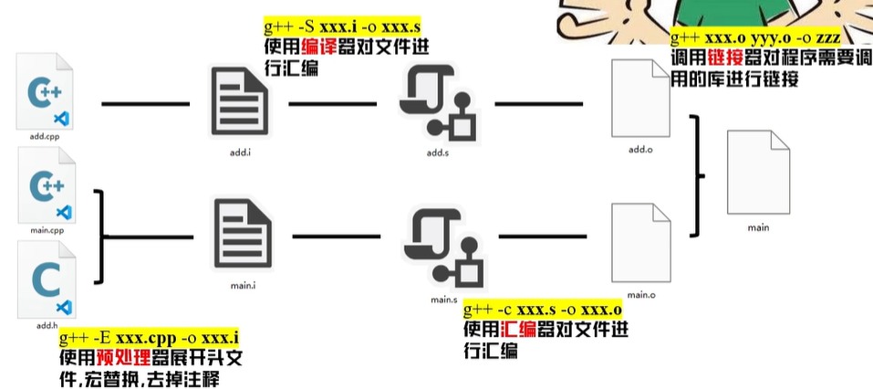
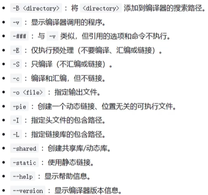

## cpp/c语言为什么用头文件？

引入头文件后，会将头文件中的内容展开到当前文件(原封不动的复制过来)。

引入头文件可以减少重复，额可以减轻依赖

## 项目根目录下的CMakeLists.txt内容

```c++
cmake_minimum_required(VERSION 3.15) # 规定的最低版本 不写也行
project(cmake_study) # 起一个项目名
add_subdirectory(lesson1_1) # 添加子目录 会自动区寻找子目录下的CMakelists.txt
    
//lesson1_1目录下的内容 有一个add.cpp add.h main.cpp CMakelists.txt
//lesson1_1 CMakelists.txt内容
add_executable(lesson1_1 main.cpp add.cpp)
```

## 打包静态库

```c++
//根目录的CMakelists.txt不变
//lesson2_1目录下的add目录有add.cpp add.h  lib目录下有CMakelists.txt
//lesson2_1 CMakelists.txt内容
```

## Linux平台下C++代码编译流程



**四个流程：预处理，编译，汇编，链接**

**1. 预处理** 

**2. 编译**

​	编译的输出结果是汇编文件，输入是.i结尾的文件(预处理的结果)  输出是.s结尾的文件

**3. 汇编** 

​	会变成机器码的二进制文件，如果一个函数只有声明是可以经过预处理，编译和汇编的到达现在这步二进制文件，在最后的链接阶段才会找函数的具体实现。



## Linux平台下cmake流程

在项目目录下新建`build`目录，这个`build`目录与顶层`CMakeLists.txt`文件同层，然后`cd`到`build`下，`cmake ..`表示将编译与`build`同层的`CMakeLists.txt`，然后将生成的文件都放在当前的build目录下。

`cmake .. -DCMAKE_VERBOSE_MAKEFILE=ON`表示展示`camke`过程。其中包括生成`makefile`等过程。

