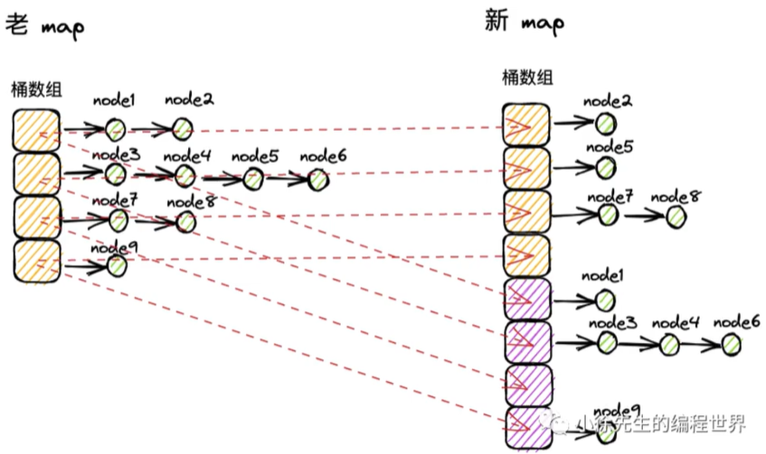
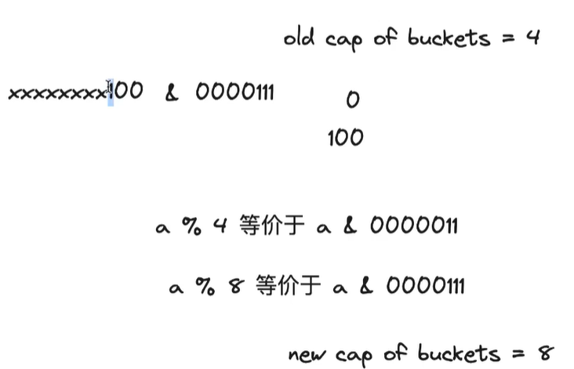
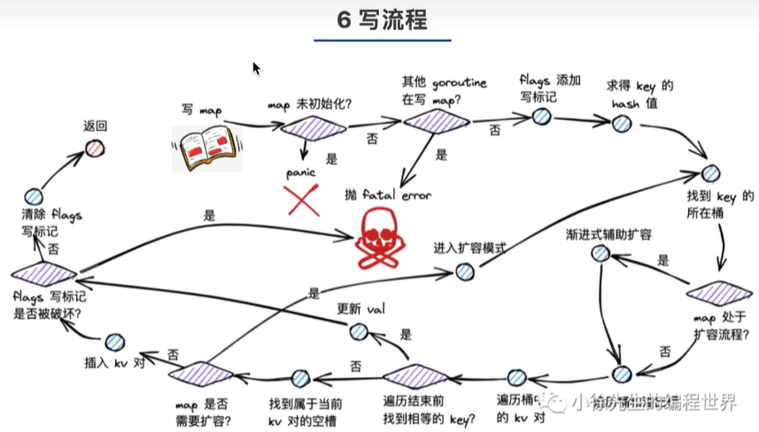
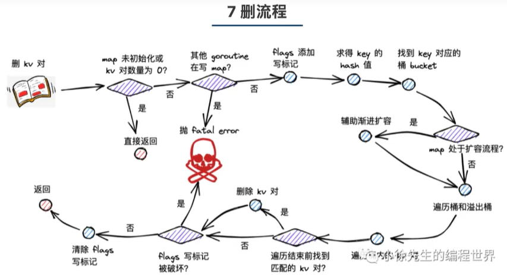
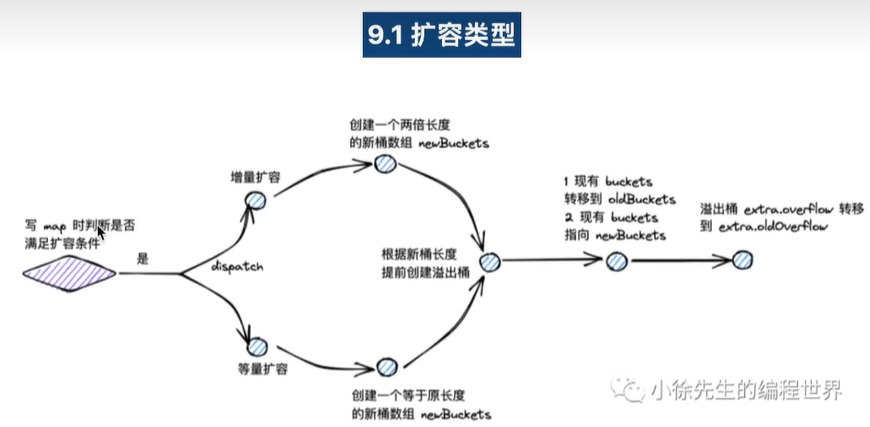

#  go run和go build

# 一. Go基础语法

https://www.bilibili.com/read/readlist/rl496566

## init函数

1. 每个包都可以有自己的init函数 且可以有多个

2. 执行顺序(取决于包的依赖关系):被依赖的全局变量>>被依赖包的init函数>>...>>main包的全局变量>>main的init函数>>main函数

## 数组

```go
//数组 
//数组长度不能为空 为空就是切片类型 长度是数组的一部分  
//1. 注意长度不能留空，留空是切片类型
//2. 长度是数组数据类型的一部分，因此数组长度不能改变
//3. 但等号右侧的长度可以简写为[…]自动判断 
var a [3]int = [3]int{1, 456, 789}
a[0] = 123
a[1] = 234
a[2] = 789
var b  = [...]int{1, 456, 789}
//遍历数组
for i := 0; i < len(a); i++ {
    fmt.Printf("a[%v]=%v\n", i, a[i])
}
// for range 遍历
for i, v := range a { // i 索引  v 值
    fmt.Printf("a[%v]=%v\n", i, v)
}
for _, v := range a { // i 索引  v 值 可以用_占位
    fmt.Printf("%v\n", i, v)
}

//多维数组
var c [3][4]int = [3][4]int{
    {1,2,3,4},
    {5,6,7,8},
    {9,10,11,12},
}
//多维数组遍历
for i, v := range c {
    for i2, v2 := range v {
        fmt.Printf("a[%v][%v]=%v\n", i, i2, v2)
    }
    fmt.Println()
}
```

## 切片

```go
切片是对数组的引用 改动切片也会改动原数组
切片本身并不存储任何数据，它只是描述了底层数组中的一段
切片是引用类型，默认值为nil
//声明一个数组
array := [5]int{1,2,3,4,5}
// 引用的区间是前闭后开 从第一项开始可省略不写 引到最后一项也可以不写  例如[:]
var s1 []int = array[0:len(array)]
//切片还可以引用切片 指向的是同一个底层数组
s2 := s1[:]
//切片是引用类型，默认值为nil 
var s3 []int//空切片 没有分配空间
//可以用make给切片分配内存空间  分配内存空间make([]Type, len, cap) 获取长度和容量 len() cap()
s3 = make([]int, 3, 5) // 底层创建了一个长度为3的数组 但是有预留空间 容量为5  容量可以不写 默认与长度相同获取
// 简写 由系统自动创建底层数组
s4 := []int{1, 2, 3} 
//切片可以追加元素 但是就得新创建一个数组 不再引用原数组
s1 = append(s1,6,7,8)
//切片追加切片
s5 := append(s1, s2...) // 底层也是创建了新数组
//复制数组 copy([]Type,[]Type)
s6 := []int{1, 1}
copy(s6, s5)//将s5拷贝到s6中 超出范围不在复制了 如果短就能复制多少复制多少
//string和[]byte 可以互相转换 格式字符通用 可以直接用for range遍历字符串
str := "hello 世界"
fmt.Printf("[]byte(str)=%s\n", []byte(str))

// 在函数中可以通过...接受不确定个数的参数
func SelectByKey(text ...string) (key int) {
    for i, v := text {
        
    }
}


//字符串长度直接用len输出的是字节数。
//如果包含非ascii码(汉字)，可以转[]rune，或者使用unf8包中的字符串长度的方法
s3 := "你好世界"
len([]rune(s3))
//字符串也可以从已有字符串的切片
s4 := s3[3:7]
```

## map

```go
本质为无序键值对(key-value)
map是引用类型，默认值为nil
容量会自动增长

数据类型：map[key类型]value类型
var m1 map[string]string //map的key只能是基本数据类型 value可以是任何类型
m1 = make(map[string]string, 2) //2是初始长度 可以省略默认为1  map的容量自增长的 初始长度写不写都无所谓
m1["q"] = "123"
m1["w"] = "456"
//直接定义
m2 := map[string]string {
    "e" : "768",
    "f" : "901", 
}

//map查找 通过双赋值检测某个key是否存在
v, ok := m2["e"] // 如果m2["e"]存在 v就会获得对应的值 如果不存在v会被赋值为对应类型的初始值 ok是个bool代表是否存在
if ok {
    fmt.Println()
} else {
    fmt.Println()
}

//删除
delete(m1, "q")
//删除所有的key value 两种方法
m1 = nil // 让引用置空
m2 = make(map[string]string) // 让引用引用新make的map
//遍历map 因为map不能用len函数 所以只能用for range遍历
for key, value := range m1 {
    fmt.Println()
}
```

## 自定义数据类型和类型别名

```go
//type 等同 typedef 但是两种类型赋值需要类型转换
type mesType uint16
var x uint16 = 1000
var textMes mesType = mesType(x)
//type =  这种不需要类型转换
type myUint16 = uint16
var y myUint16 = x
```

## 结构体

```go
//定义
type User struct {
    Name string
    Id uint32
}

var u1 User = User{
    Name : "zhangsan",
}
//结构体字段通过“.”访问 
u1.Id = 10000

//结构体指针  两种方式
var u2 *User = new(User)
var u3 *User = &User{
    Name : "lisi",
}
//通过指针赋值成员
(*u2).Id = 10001 // 可以简写 u2.Id = 10001    .的优先级高于&和*

//继承 直接把父类当作成员写在子类中  可以是父类的类型也可以是指针类型
type Account struct {
    User
    password string
}
type Constact struct {
    *User
    Ramark string
}
var a1 Account = Account{
    User : User{
        Name : u1.name,
    },
    password : "123456",
}
var c1 *Contact = &Contact{
    User : & User{},
    Remark : "wangmazi",
}
c1.Name = "wangwu" //Account和父类没有重复成员 可以直接使用
c1.User.Name = "wangwu" // Account和父类有重复成员  需要加上父类的类名
```

## 方法

```c++
与特定类型绑定的函数
类型的定义和方法需要在同一个包内
func (接收参数名 类型)方法名(形参列表)返回值列表{}
接收参数可以使用指针 
    
// 相当于类的成员方法 就是在函数名前面加个类对象
fun (u User) printName() {
    fmt.Println("u.name=", u.name)
}
u := User{
    Name : "zhangsan"
}
u.printName()
//但是上面的类成员方法传入的是对象 是拷贝的 并不能修改实参 所以可以改成传入指针
func (u *User)setId() {
    (*u).Id = 10000
}
u.setId()
```

## 接口

```go
// 接口是方法定义的集合  
//方法名(形参类型)返回值类型
// 接口本身不能绑定方法

//其实就是把一些的类的共有方法放在接口中 然后可以用接口类型接受拥有该方法的类型  然后可以根据具体的类型调用具体的方法
//其实就是类似与c++的虚函数 接口相当于虚基类 可以多态
type textMes struct {
    Type string
    Text string
}
func (tm *textMes)setType{
    tm.Type = "文字消息"
}

type imgMes struct {
    Type string
    Img string
}
func (im * imgMes)setType{
    tm.Type = "图片消息"
}

//定义接口 将textMes和imgMes中setType方法抽象出来
type Mes interface {
    setType()
}

func SendMes(m Mes) {
    m.setType()
}
tm := txtMes{
    Type : "文字消息",
    Text : "文字内容",
}
SendMes(&tm)


//可以对传入的接口类型的形参进行类型还原
//switch…case + interface.(type)
//.(type)不能在 switch…case 外使用
func SendMes(m Mes) {
    m.setType()
    switch mptr := m.(type) {
        case *textMes:
        mptr.setText()
        case *imgMes:
        mptr.setImg()
    }
}

//还原为原始类型 interface.(Type)
//如果接口没有保存类型，则会报错
//可返回两个值
value, ok :=  interface.(Type) 

// 空接口可以接收任何类型

//nil 值：有类型没有值，接口本身并不是 nil，可以处理

//nil 接口：即没有保存值，也没有保存类型，使用时会报错
```

## 协程

```c++
//Goroutine 是 Go 运行时管理的轻量级线程
//主线程结束时，协程会被中断，需要有效的阻塞机制 等待协程结束
//开一个协程去调用函数
go PrimeNum(i)
//操作共享数据时需要互斥锁
lock sync.Mutex//锁定义
lock.Lock() //上锁
lock.Unlock()//解锁
```

## channel 管道

```go
channel，官方翻译为信道，是一种带有类型的管道
引用类型，使用前需要make(Type, (缓冲区容量))
不带缓冲区的管道必须结合结合协程使用 
可以查看长度len(channel)或容量cap(channel)
存入: channel <- value
取出: value, (ok) <- channel
丢弃： <- channel
先进先出，自动阻塞
数据需要保持流动 ，否则会阻死报错
    
//channel 定义  chan代表管道类型后面int代表管道中存储的类型 管道时引用类型 使用时需要make
var c1 chan int = make(chan int, 1000) //1000代表缓冲区的大小 可以不写
// 向管道中存入数据
c1 <- 1

func pushNum(c chan int){
    for i := 0; i < 100; i++ {
        c <- i
    }
    close(i) //关闭管道
}
func Channel() {
    var c1 chan int = make(chan int)
    go pushNum(c1) // 开一个协程 向管道中push数据
    //用一个for循环从管道中取数据
    for {
        v, ok := <- c1 // 如果管道中没有数据 这里取数据会阻塞
        if ok {
            fmt.Printf("%v\t", v)
        } else {
            break
        }
    }
}
```

## 随机数

```go
//学习标准库 math/rand
//设置随机数种子
rand.Seed(int64)
//Unix时间:UTC(世界标准时间)1970年1月1日0时0分0秒起至现在所经过的时间纳秒:十亿分之1秒
//Go获取Unix纳秒:
time.Now().UnixNano()
//所以可以将随机数种子设置成这个
rand.Seed(timie.Now().UnixNano())
//生成随机数 括号里的11表示随机数的范围 前开后闭
rand.Intn(11) 
    
//随机整数
Int31n(n int32) int32 // [0,n) 非负int31
Int63n(n int64) int64 // [0,n) 非负int63
Intn(n int) int // [0,n) 非负int
//非负小数
Float32()float32//[0.0,1.0)
Float64()float64//[0.0,1.0)
```

## 字符串类型转化   字符串常见操作 (strings包常见函数)  中文字符常见操作 (utf8包常见函数) 

```go
//Sprintf() 与Printf()使用方法一直 但是不是  打印到控制台 而是返回一个字符串
s2 := fmt.Sprintf("%d@%s", 123, "fangchannel.com")
//Sscanf() 将字符串按照格式解析后 赋值给对应的变量 返回值n代表解析了几个数据
var i2 int
var s3 string
n := fmt.Sscanf(s1, "%d@%s", i2, s3) // 结果: i2 = 123 s3 = fangchannel.com

//strconv包
strconv.Itoa()//整数转字符串
strconv.Atoi() //字符串转 整数
strconv.Format...()//基本类型转字符串
strconv.Parse...() // 字符串解析为基本类型
```

https://www.bilibili.com/read/cv14519061/?from=readlist

## 时间常见操作(time包)

https://www.bilibili.com/read/cv14547209/?from=readlist

## 指针

go语言在使用指针时，会使用内部的垃圾回收机制， 开发人员不需要手动释放内存

c语言不允许返回栈上的指针，go语言可以返回栈上的指针，程序会在编译的时候就确定了变量的分配位置

编译的时候如果发现有必要的话，就将变量分配到堆上

## 不支持的语法

1. --i ++i不支持
2. 不支持地址加减
3. 不支持三目运算符 ? :
4. 只有false代表逻辑假  数字0和nil不能代表假逻辑 

# 二. Go语言设计与实现

### 2.1编译过程

编译过程：词法分析和语法分析 类型检查 中间代码生成 机器码。

### 2.2语法分析和词法分析

生成词法分析生成Token序列，然后输入给语法分析，在词法和语法分析之后会得到每个文件对应的抽象语法树。

### 2.3 类型检查

类型检查会遍历抽象语法树中的节点，

静态类型检查和动态类型检查不是完全冲突和对立的，很多编程语言都会同时使用两种类型检查。

Go 语言的编译器不仅使用静态类型检查来保证程序运行的类型安全，还会在编程期间引入类型信息，让工程师能够使用反射来判断参数和变量的类型。当我们想要将 `interface{}` 转换成具体类型时会进行动态类型检查，如果无法发生转换就会发生程序崩溃。

 Go 语言中很常见的内置函数 `make`，在类型检查阶段之前，无论是创建切片、哈希还是 Channel 用的都是 `make` 关键字，不过在类型检查阶段会根据创建的类型将 `make` 替换成特定的函数，后面[生成中间代码](https://draveness.me/golang/docs/part1-prerequisite/ch02-compile/golang-ir-ssa/)的过程就不再会处理 `OMAKE` 类型的节点了，而是会依据生成的细分类型处理：

**slice**

如果 `make` 的第一个参数是切片类型，那么就会从参数中获取切片的长度 `len` 和容量 `cap` 并对这两个参数进行校验，其中包括：

1. 切片的长度参数是否被传入；
2. 切片的长度必须要小于或者等于切片的容量；

**map**

第二种情况就是 `make` 的第一个参数是 `map` 类型，在这种情况下，第二个可选的参数就是哈希的初始大小，在默认情况下它的大小是 0，当前分支最后也会改变当前节点的 Op 属性

**channel**

`make` 内置函数能够初始化的最后一种结构就是 [Channel](https://draveness.me/golang/docs/part3-runtime/ch06-concurrency/golang-channel/) 了，从下面的代码我们可以发现第二个参数表示的就是 Channel 的缓冲区大小，如果不存在第二个参数，那么会创建缓冲区大小为 0 的 Channel：

### 2.4中间代码生成

在编译过程中，编译器会在将源代码转换到机器码的过程中，先把源代码转换成一种中间的表示形式，即中间代码[1](https://draveness.me/golang/docs/part1-prerequisite/ch02-compile/golang-ir-ssa/#fn:1)。

###  3.1数组

```go
arr1 := [3]int{1, 2, 3}
arr2 := [...]int{1, 2, 3}
```

上述两种声明方式在运行期间得到的结果是完全相同的，后一种声明方式在编译期间就会被转换成前一种，这也就是编译器对数组大小的推导。

对于一个由字面量组成的数组，根据数组元素数量的不同，编译器会在负责初始化字面量的 [`cmd/compile/internal/gc.anylit`](https://draveness.me/golang/tree/cmd/compile/internal/gc.anylit) 函数中做两种不同的优化：

1. 当元素数量小于或者等于 4 个时，会直接将数组中的元素放置在栈上；
2. 当元素数量大于 4 个时，会将数组中的元素放置到静态区并在运行时取出；

### 3.2切片

​	切片类型的声明方式与数组有一些相似，不过由于切片的长度是动态的，所以声明时只需要指定切片中的元素类型：

```go
[]int
[]interface{}
```

​	切片引入了一个抽象层，提供了对数组中部分连续片段的引用，而作为数组的引用，我们可以在运行区间可以修改它的长度和范围。当切片底层的数组长度不足时就会触发扩容，切片指向的数组可能会发生变化，不过在上层看来切片是没有变化的，上层只需要与切片打交道不需要关心数组的变化。

Go 语言中包含三种初始化切片的方式：

1. 通过下标的方式获得数组或者切片的一部分；
2. 使用字面量初始化新的切片；
3. 使用关键字 `make` 创建切片：

```go
arr[0:3] or slice[0:3]
slice := []int{1, 2, 3}
slice := make([]int, 10)
```

​	下标初始化切片不会拷贝原数组或者原切片中的数据，它只会创建一个指向原数组的切片结构体，所以修改新切片的数据也会修改原切片。

​	当使用字面量 `[]int{1, 2, 3}` 创建新的切片时，

```go
var vstat [3]int
vstat[0] = 1
vstat[1] = 2
vstat[2] = 3
var vauto *[3]int = new([3]int) //new？
*vauto = vstat
slice := vauto[:]
```

1. 根据切片中的元素数量对底层数组的大小进行推断并创建一个数组；
2. 将这些字面量元素存储到初始化的数组中；
3. 创建一个同样指向 `[3]int` 类型的数组指针；
4. 将静态存储区的数组 `vstat` 赋值给 `vauto` 指针所在的地址；
5. 通过 `[:]` 操作获取一个底层使用 `vauto` 的切片；

​	make关键字方式，根据条件

1. 切片的大小和容量是否足够小；
2. 切片是否发生了逃逸，最终在堆上初始化

第一种情况：切片的大小和容量是否足够小时，在编译器完成，在站上或者静态存储区创建，并将 `[:3]` 返回。

第二种情况：当切片发生逃逸或者非常大时，运行时需要 [`runtime.makeslice`](https://draveness.me/golang/tree/runtime.makeslice) 在堆上初始化切片，[`runtime.makeslice`](https://draveness.me/golang/tree/runtime.makeslice) 在最后调用的 [`runtime.mallocgc`](https://draveness.me/golang/tree/runtime.mallocgc) 是用于申请内存的函数，这个函数的实现还是比较复杂，如果遇到了比较小的对象会直接初始化在 Go 语言调度器里面的 P 结构中，而大于 32KB 的对象会在堆上初始化。

**追加和扩容**

如果 `append` 返回的新切片不需要赋值回原有的变量，果在追加元素后切片的大小大于容量，那么就会调用 [`runtime.growslice`](https://draveness.me/golang/tree/runtime.growslice) 对切片进行扩容并将新的元素依次加入切片。

如果使用 `slice = append(slice, 1, 2, 3)` 语句，那么 `append` 后的切片会覆盖原切片，然后和不覆盖原变量的逻辑差不多。

### 3.3哈希表

go语言中的map使用类似于拉链法的方法，当哈希表的负载因子过大时触发扩容，创建更多的桶。

go中哈希表的数据结构


桶分为正常桶和溢出桶，两种不同的桶在内存中是连续存储的。单个桶装满时就会使用溢出桶存储。使用溢出桶能够减少扩容频率。


上图为单个桶的结构，在循环中，它会先比较哈希的高 8 位和桶中存储的 `tophash`，后比较传入的和桶中的值以加速数据的读写。用于选择桶序号的是哈希的最低几位，而用于加速访问的是哈希的高 8 位，这种设计能够减少同一个桶中有大量相等 `tophash` 的概率影响性能。如上图所示，每一个桶都是一整片的内存空间，当发现桶中的 `tophash` 与传入键的 `tophash` 匹配之后，我们会通过指针和偏移量获取哈希中存储的键 `keys[0]` 并与 `key` 比较，如果两者相同就会获取目标值的指针 `values[0]` 并返回

```go
//map初始化
hash := map[string]int{
	"1": 2,
	"3": 4,
	"5": 6,
}
```

当哈希表中的元素数量少于或者等于 25 个时，编译器会将字面量初始化的结构体转换成以下的代码，将所有的键值对一次加入到哈希表中:

```go
hash := make(map[string]int, 3)
map["1"] = 2
map["3"] = 4
map["5"] = 6
```

这种初始化的方式与的[数组](https://draveness.me/golang/docs/part2-foundation/ch03-datastructure/golang-array/)和[切片](https://draveness.me/golang/docs/part2-foundation/ch03-datastructure/golang-array-and-slice/)几乎完全相同。

一旦哈希表中元素的数量超过了 25 个，编译器会创建两个数组分别存储键和值，这些键值对会通过如下所示的 for 循环加入哈希：

```go
hash := make(map[string]int, 26)
vstatk := []string{"1", "2", "3", ..., "26"}
vstatv := []int{1, 2, 3, ... ,26}
for i := 0; i < len(vstatk); i++ {
    hash[vstatk[i]] = vstatv[i]
}
```

这里展开的两个切片 `vstatk` 和 `vstatv` 还会被编辑器继续展开，具体的展开方式可以阅读上一节了解[切片的初始化](https://draveness.me/golang/docs/part2-foundation/ch03-datastructure/golang-array-and-slice/)，不过无论使用哪种方法，使用字面量初始化的过程都会使用 Go 语言中的关键字 `make` 来创建新的哈希并通过最原始的 `[]` 语法向哈希追加元素。

数据结构的写一般指的都是增加、删除和修改，增加和修改字段都使用索引和赋值语句，而删除字典中的数据需要使用关键字 `delete`：

```go
hash[key] = value
hash[key] = newValue
delete(hash, key)
```

**发生hash扩容的情况：**

1. 负载因子超过6.5
2. 哈希使用了太多的溢出桶

Go语言哈希的扩容不是一个原子的过程。

#### 小徐先生1212 解说Golnag map底层原理

map在没有初始化的情况下进行访问会引发panic。

需要注意，在执行map遍历操作时，获取的key-value对并没有一个固定顺序，因此前后两次遍历顺序可能存在差异。

map不是并发安全的数据结构，存在并发读写时，会抛出fatal error。

map中，桶数组长度为2的整数次幂。 每个桶可以存放8个key-value对，倘若超过8个key-value对打到桶数组的同一个索引中，此时会通过创建桶链表的方式化解这一问题。


写一个元素的流程：

1. 桶数组中的桶，严格意义上是一个单向桶链表，以桶为节点进行串联
2. 每个桶固定可以存放8个key-value对
3. 当key命中一个桶时，首先根据开放寻址法，在桶的8个位置中寻找空位进行插入
4. 如果桶的8个位置都已被占满，则基于桶的溢出桶指针，找到下一个桶，重复第三步
5. 如果遍历到链表尾部，仍未找到空位，则基于拉链法，在桶链表尾部续接新桶，并插入key-value对

map的扩容分为：增量扩容和等量扩容。


等量扩容：在删除节点后，会在桶上留下空洞，可能会出现，桶链表很长，但是数据不是那么多，此时触发等量扩容，填补空洞。

1. 当桶内key-value总数/桶数组长度>6.5时发生增量扩容，桶数组长度为原来的两倍
2. 当桶内溢出桶的数量大于等于2^B(B为桶数长度的指数，B最大取15)，发生等量扩容，桶的长度保持为原值。简单说就是溢出桶数量已经大于原本的桶数量，此时发生等量扩容。
3. 发生扩容后，原来的同数组并不会立即删除，而是和新的同数组同时存在，进行渐进rehash，采用渐进扩容的方式，当桶被实际操作到时，有使用者完成数据迁移，避免因为一次性的全量数据迁移引发性能抖动。



扩容之后hash函数是不会发生变化的，不然会有性能损耗，同数组的长度会发生变化。原来的key-value在新的桶数组中的索引是确定的，要么是原来的位置，要么是原来长度的整数倍。具体看下图。a是hash函数的结果，当扩容后，对8取余的结果只依赖倒数第三位，如果是0就和原来一样，如果是1，刚好比原来的长度大1倍。



**map数据结构：**

hmap ：

count int :总的key-value的数量

B uint8 ： 桶数组长度为2^B

buckets unsafe.pointer  桶数组指针   桶数组起点地址

extra   *map.extra  提前申请的溢出桶空间

其实正常桶和溢出桶的空间是连续的。

**桶数据结构：**

```go
type bmap struct {
    tophash [bucketCnt]uint8
}//只存放了tophash 因为桶中的hash key value大小全部都固定 有了hash的地址可直接通过偏移找到key和hash
```

map读流程







map的遍历时不固定的，是随机的，桶的起始节点是随机的，桶内的凹槽起始节点也是随机的。然后在当前点向后遍历完再从头开始。如果处于扩容流程中，那要保证老桶中的数据的顺序是在新桶中的数据。



### 3.4 字符串

### 6.5调度器

#### 小徐先生1212解说golang Gmp实现原理

协程：在先有线程的情况下，在用户态开发得到的协程，协程是在用户态的，比线程低一级。在底层的物理意义上还是线程。协程对线程是多对一的关系。创建、销毁、调度都是在用户态完成。

goroutine把协程和线程的强绑定给消除掉了，是通过在协程和线程之间加了一层调度器实现的。

**Goroutine核心如下：**

1. 与线程才能在映射关系为M：N
2. 创建、销毁、调度是在用户态完成，对内核透明，足够轻便
3. 可利用多个线程，实现并行
4. 通过调度器的周旋，实现和线程的动态绑定和灵活调度
5. goroutinue的栈空间大小可动态扩缩，因地制宜

**GMP模型**

gmp = goroutinue + machine(可以简单理解为内核视角下的一个线程)+processor(调度器)      (+ 一套有机组合的机制)

**g：**即goroutinue，g有自己的运行栈、状态以及执行的任务函数  g需要绑定到p才能执行，在g的视角中，p就是它的cpu。

**p：**即processor，是调度器，实现g和m的动态有机结合，g只有被p调度，才得以执行，对于m而言，p是其执行代理，p的数量据欸的那个g最大并行数量。

**m：**m即machine，对线程的抽象，m不直接执行g，而是先和p绑定，由其实现代理，借由p的存在，m无需和g绑死，也无需记录g的状态信息，因此g在全生命周期中可以实现跨m执行。


```go
//一些核心的数据结构
//src/runtime/runtime2.go
type g struct {
    goid    int64 // 唯一的goroutine的ID
    sched gobuf // goroutine切换时，用于保存g的上下文
    stack stack // 栈
    gopc        // pc of go statement that created this goroutine
    startpc    uintptr // pc of goroutine function
    ...
}
type p struct {
    lock mutex
    id          int32
    status      uint32 // one of pidle/prunning/...

    // Queue of runnable goroutines. Accessed without lock.
    runqhead uint32 // 本地队列队头
    runqtail uint32 // 本地队列队尾
    runq     [256]guintptr // 本地队列，大小256的数组，数组往往会被都读入到缓存中，对缓存友好，效率较高
    runnext guintptr // 下一个优先执行的goroutine（一定是最后生产出来的)，为了实现局部性原理，runnext中的G永远会被最先调度执行
    ... 
}

type m struct {
    g0            *g     
    // 每个M都有一个自己的G0，不指向任何可执行的函数，在调度或系统调用时，M会切换到G0，使用G0的栈空间来调度
    curg          *g    
    // 当前正在执行的G
    ... 
}
//还有schedt结构，是个全局goroutinue队列，访问需要加锁
type schedt struct {
    ...
    runq     gQueue // 全局队列，链表（长度无限制）
    runqsize int32  // 全局队列长度
    ...
}
```

### 7.1 内存分配器

**设计原理：**


### 7.2 垃圾收集器

### 7.3 栈内存管理

# 三.Golang context实现原理


# 四. go八股

### defer执行时机

`defer`的执行时机在`return`执行完，函数退出前执行，`defer`执行时可以修改函数返回值。
