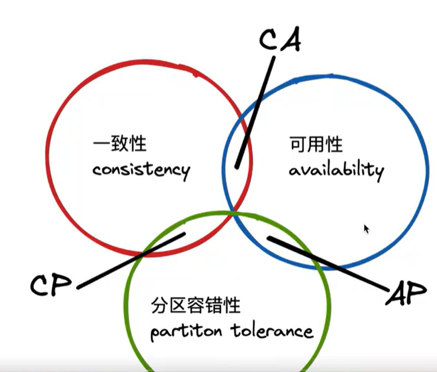
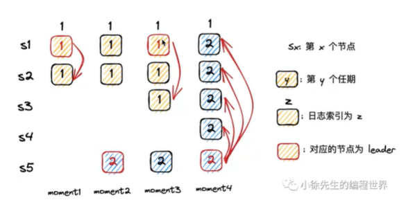

# Raft

什么是raft算法

Raft算法是一种共识算法，用于在分布式系统中实现一致性。它是由Diego Ongaro和John Ousterhout于2013年提出的，旨在提供一种更易理解和可靠的分布式一致性算法。

Raft算法解决了分布式系统中的领导者选举、日志复制和安全性等关键问题。它将分布式系统中的节点划分为 **领导者（leader）、跟随者（follower）和候选者（candidate）** 三种角色，并通过一个选举过程来选择领导者。

在Raft算法中，领导者负责接收客户端的请求，并将请求复制到其他节点的日志中。跟随者和候选者则通过与领导者保持心跳和选举的方式来保持一致性。如果领导者失去联系或无法正常工作，系统会触发新一轮的选举过程，选择新的领导者。

Raft算法的设计目标是可理解性和可靠性。相比于其他共识算法如Paxos，Raft算法更加直观和易于理解，使得开发人员能够更容易地实现和调试分布式系统。

#### raft优缺点

Raft算法作为一种共识算法，在分布式系统中具有一些优点和缺点。

**优点：**

1. **简单易懂**：相比于其他共识算法，Raft算法的设计更加直观和易于理解，使得开发人员能够更容易地实现和调试分布式系统。
2. **安全性**：Raft算法保证了系统的安全性，通过领导者选举和日志复制等机制来确保数据的一致性和可靠性。
3. **高可用性**：Raft算法能够在领导者失效时快速进行新的领导者选举，从而保证系统的高可用性。

**缺点：**

1. **性能开销**：Raft算法对于每个写操作都需要进行日志复制，这会带来一定的性能开销。相比于其他共识算法如Paxos，Raft算法的性能可能会稍差一些。
2. **领导者单点故障**：在Raft算法中，领导者是负责处理客户端请求和日志复制的节点，如果领导者失效，整个系统的性能和可用性都会受到影响。
3. **数据一致性延迟**：在Raft算法中，当领导者发生变更时，新的领导者需要等待日志复制完成才能处理客户端请求，这可能会导致一定的数据一致性延迟。

#### 算法原理

Raft算法的核心原理包括三个关键组件：领导者选举、日志复制和安全性。

**1. 领导者选举：**

- 每个节点在任意时刻可能处于三种状态之一：领导者（leader）、跟随者（follower）和候选者（candidate）。
- 初始情况下，所有节点都是跟随者。如果一个跟随者在一段时间内没有收到来自领导者的心跳消息，它会转变为候选者并开始选举过程。（无所谓  就是选举 自己的原因也选举）
- 候选者会向其他节点发送投票请求，并在收到多数节点的选票后成为新的领导者。
- 如果在选举过程中出现多个候选者获得相同票数的情况，那么会进行新一轮的选举，直到只有一个候选者获胜。

**2. 日志复制：**

- Raft算法使用日志来记录系统中的所有操作。每个节点都有一个日志，其中包含一系列的日志条目。
- 当客户端向领导者发送写请求时，领导者会将该请求作为一个新的日志条目追加到自己的日志中，并向其他节点发送日志复制请求。
- 其他节点收到复制请求后，会将该日志条目追加到自己的日志中，并向领导者发送确认消息。
- 一旦领导者收到多数节点的确认消息，该日志条目被视为已提交，并将其应用到状态机中执行相应操作。

**3. 安全性：**

- Raft算法通过多数投票机制来确保系统的安全性。任何一条已提交的日志条目都必须在多数节点上复制和执行，才能保证数据的一致性。
- 如果一个节点成为领导者，并开始复制日志条目，但在复制完成之前失去了领导者地位，那么新的领导者将继续复制剩余的日志条目。
- 如果一个节点在复制过程中发现自己的日志与领导者的日志不一致，它将回退到领导者的日志状态，并重新进行复制。

总的来说，Raft算法通过领导者选举、日志复制和安全性机制，实现了分布式系统中的一致性和可靠性。它的设计简单易懂，易于实现，并且提供了强一致性保证。

#### 领导者选举

1. 初始状态下，所有节点都是跟随者（Follower）状态。
2. 如果一个跟随者在一段时间内没有收到来自领导者（Leader）的心跳消息，它会转变为候选者（Candidate）并开始选举过程。
3. 候选者向其他节点发送投票请求，并请求其他节点投票给自己。
4. 其他节点在收到投票请求后，如果还没有投票给其他候选者，且候选者的日志更新且比自己的日志新，就会投票给候选者。
5. 如果候选者收到了多数节点的选票（包括自己的一票），那么它就成为新的领导者。
6. 如果在选举过程中出现多个候选者获得相同票数的情况，那么会进行新一轮的选举，直到只有一个候选者获胜。

通过以上步骤，Raft 算法实现了分布式系统中的领导者选举机制，确保系统能够选出稳定的领导者来协调其他节点的操作。

## 1.复制状态机

## 2.状态简化

## 3.领导者选举

**正常情况：**

任何一条`AppendEntries`消息都会重置所有Raft节点的选举定时器。这样，只要`Leader`还在线，并且它还在以合理的速率（不能太慢）发出心跳或者其他的`AppendEntries`消息，`Followers`收到了`AppendEntries`消息，会重置自己的选举定时器，这样`Leader`就可以阻止任何其他节点成为一个候选人。所以只要所有环节都在正常工作，不断重复的心跳会阻止任何新的选举发生。当然，如果网络故障或者发生了丢包，不可避免的还是会有新的选举。但是如果一切都正常，我们不太可能会有一次新的选举。

**领导者选举失败的情况：**

1. 如果一次选举选出了0个`Leader`，这次选举就失败了。有一些显而易见的场景会导致选举失败，例如太多的服务器关机或者不可用了，或者网络连接出现故障。这些场景会导致你不能凑齐过半的服务器，进而也不能赢得选举，这时什么事也不会发生。

2. 一个导致选举失败的场景是，所有环节都在正常工作，没有故障，没有丢包，但是候选人们几乎是同时参加竞选，它们分割了选票（`Split Vote`）。假设我们有一个3节点的多副本系统，3个节点的选举定时器几乎同超时，进而期触发选举。首先，每个节点都会为自己投票。之后，每个节点都会收到其他节点的`RequestVote`消息，因为该节点已经投票给自己了，所以它会返回反对投票。这意味着，3个节点中的每个节点都只能收到一张投票（来自于自己）。没有一个节点获得了过半投票，所以也就没有人能被选上。接下来它们的选举定时器会重新计时，因为选举定时器只会在收到了`AppendEntries`消息时重置，但是由于没有`Leader`，所有也就没有AppendEntries消息。所有的选举定时器重新开始计时，**如果我们不够幸运的话，所有的定时器又会在同一时间到期，所有节点又会投票给自己，又没有人获得了过半投票，这个状态可能会一直持续下去。Raft不能完全避免分割选票（Split Vote），但是可以使得这个场景出现的概率大大降低。Raft通过为选举定时器随机的选择超时时间来达到这一点。一个明显的要求是，选举定时器的超时时间需要至少大于Leader的心跳间隔。不同节点的选举定时器的超时时间差（S2和S3之间）必须要足够长，使得第一个开始选举的节点能够完成一轮选举。这里至少需要大于发送一条RPC所需要的往返（Round-Trip）时间。**

## **4.日志复制**

## 5.安全性

## 6.集群成员变更

## 7.ParallelRaft

## 小徐先生 解析分布式共识算法之Raft算法

### p2分布式场景问题

**1.1** 集群节点数量有一个合适的范围，对增加节点不加以约束，会导致集群内部的网络请求成为系统瓶颈。

**1.2**分布式的优势和问题

​	纵向分布式 : 微服务

​	横向分布式 : 系统内不同节点共同承担一个职责  好处: 让第一节点压力减小(负载均衡)  避免单点故障(主从库数据备份)

不同节点需要保证**数据一致性**

### p3 CAP理论

Consitency:一致性 Availability 可用性 Partiition tlerance 分区容错性

### 领导者选举

1. follower会建立一个心跳检测定时器，定期接收leader的心跳，当超过指定时长未收到leader的心跳，转为canditate发起选举，尝试成为新leader

2. 什么样的follower有资格成为leader? 任期和日志足够新 拉票超过半数

###   为什么能保证一个任期内至多只有一个领导者？

通过领导者选举机制保证。

cnadidate选举前会自增Term，任期是单调递增的。

在选举机制上，一个follower只有一票，只能投给一个candidate。

cnadidate必须拿到半数以上的赞同票才能当选leader。

### 为什么能保证通过任期和索引相同的日志内容一定相同？

在同一个任期内只有一个领导者，在同一个任期内的日志只能由领导者颁发。

### 是否一项提议只需要被多数派通过就可以提交？

不可以。

可能出现被多数派认可的已经提交的日志被覆盖掉。

节点5在第二次成为leader时会覆盖掉日志1。

解决方法新上任的leader需要至少完成一笔本任期的写请求，才能够执行提交动作。上图，在节点1再次成为leader后必须写一条任期3的数据(防止s5成为leader)后，才能提交日志1。

### 如何解决网络分区引发的无意义选举？

在网络小分区中，选不出leader，就会一直递增任期号，在后续加入到大分区中时，由于任期号非常大会冲击原来的大分区，然是这个小分区的节点不会当选leader因为日志落后，但是原来大分区也不会有leader产生因为任期号被冲击了，但是会一段时间任期号追上来就可以了。但是这段时间耗费资源进行选举。

解决方法，让候选者发起选举前，先试探所有节点，得到大多数响应再发起选举。

# 面试题

2、 介绍一下raft的领导者选举、日志复制的过程
3、日志同步失败后的操作和优化
4、raft中要持久化的状态以及他们为什么要持久化，举一些场景
5、snapshot的操作